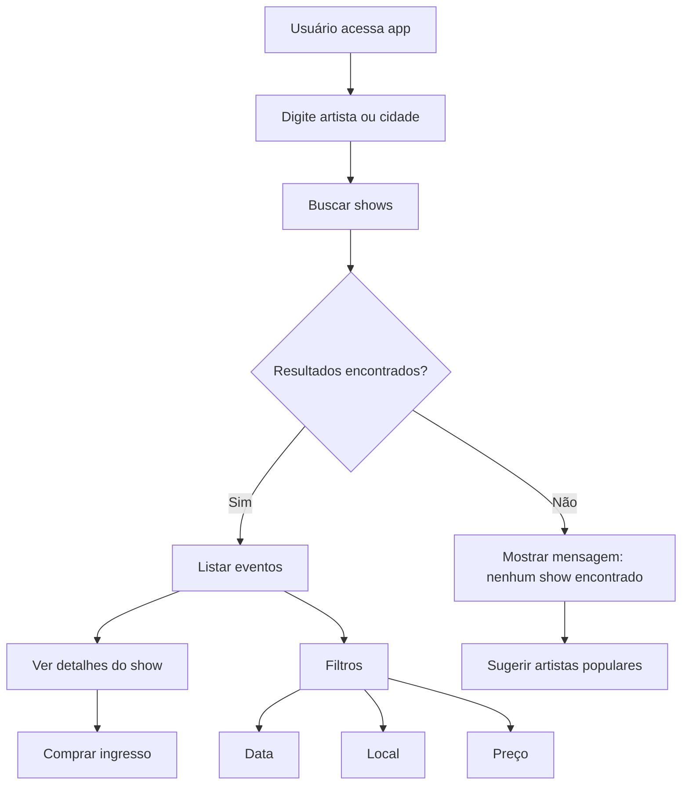

# [Radar de Shows]

## teremos que criar um radar de shows que encontre a agenda de cada artista e seus horarios disponiveis.

**Projeto:** [Radar de Shows]
**Problema que resolve:** [Procurar a disponbilidade de cada artista]

## Integrantes

| Nome              | GitHub          |
| ----------------- | --------------- |
| [Arthur Prevedel] | [@prevedel2007] |
| [Davi Vieira]     | [@dvieiraaaa]   |
| [Warley Mendes]   | [@warley1137]   |

## arquitetura

