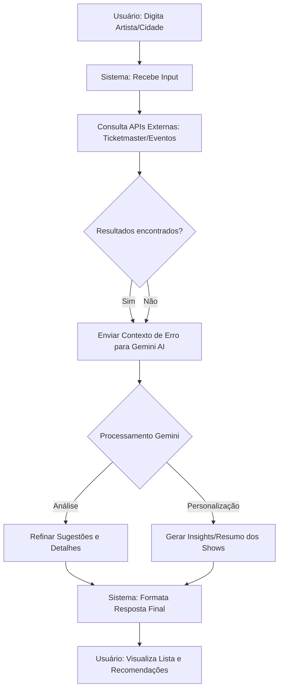

# [Radar de Shows]

## teremos que criar um radar de shows que encontre a agenda de cada artista e seus horarios disponiveis.

**Projeto:** [Radar de Shows]
**Problema que resolve:** [Procurar a disponbilidade de cada artista]

## Integrantes

| Nome              | GitHub          |
| ----------------- | --------------- |
| [Arthur Prevedel] | [@prevedel2007] |
| [Davi Vieira]     | [@dvieiraaaa]   |
| [Warley Mendes]   | [@warley1137]   |

### Diagrama

### Como funciona

O usuário informa o nome de um artista pesquisar. O sistema então consulta APIs de eventos para buscar dados atualizados e envia essas informações para o Gemini AI. A IA processa os dados brutos, organiza as informações de forma clara. Por fim, o usuário recebe uma lista detalhada e formatada com as melhores opções de shows e eventos.
